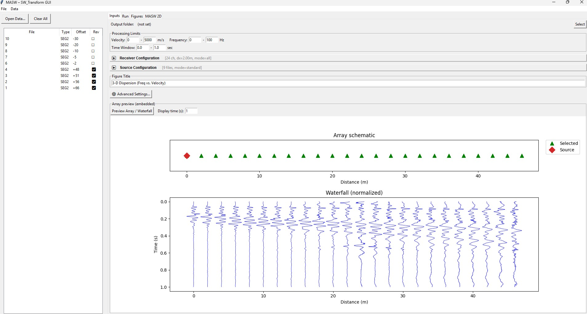
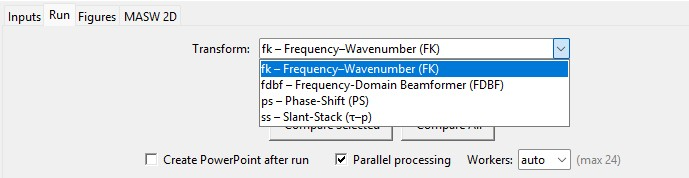
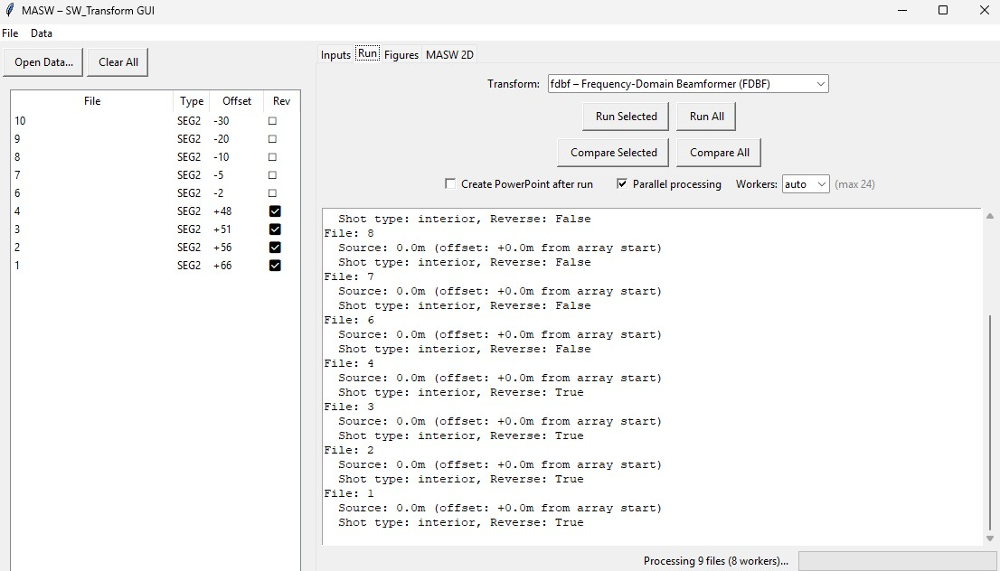
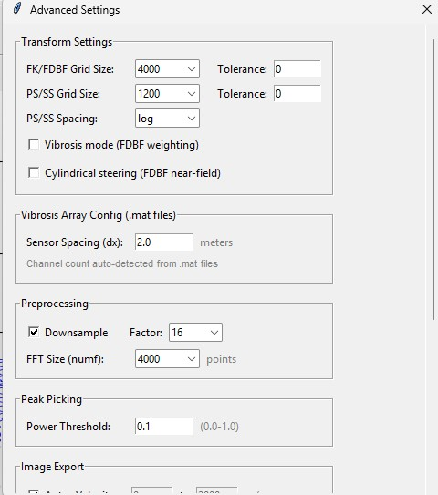
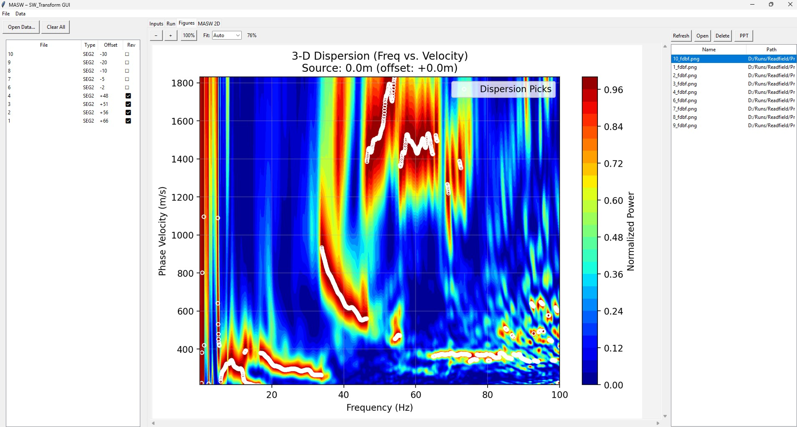
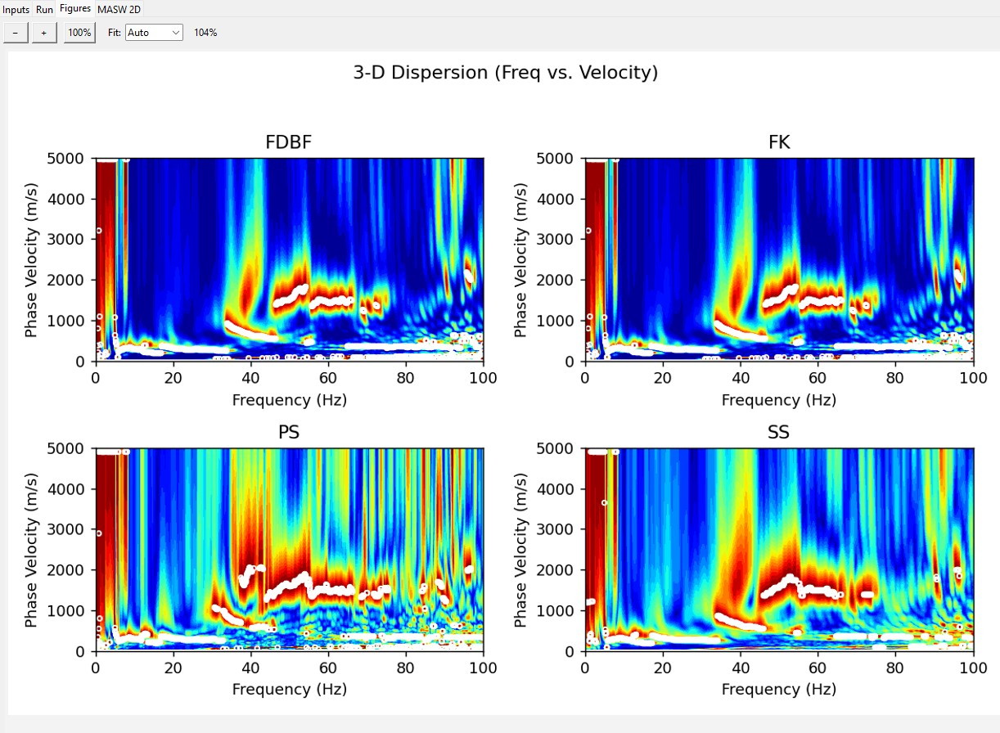
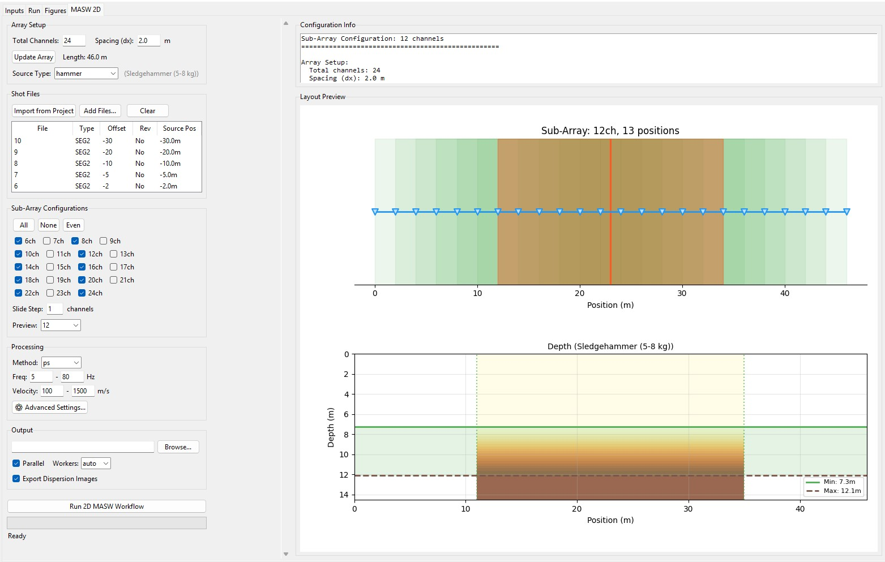
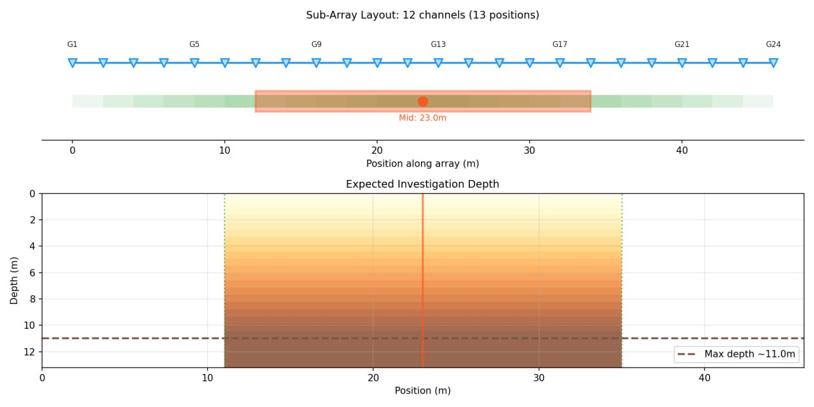

<div align="center">

# SW_Transform

### Surface Wave Dispersion Analysis Toolkit

[](https://www.gnu.org/licenses/gpl-3.0)
[](https://www.python.org/downloads/)
[](https://docs.python.org/3/library/tkinter.html)

A modular Python package for **Multichannel Analysis of Surface Waves (MASW)** — extracting dispersion curves from multichannel geophone recordings using four transform methods, with automatic peak picking and publication-quality visualization.

**Author:** Mersad Fathizadeh — Ph.D. Candidate, University of Arkansas  
📧 mersadf@uark.edu · GitHub: [@mersadfathizadeh1995](https://github.com/mersadfathizadeh1995)

</div>

---

## Overview

SW_Transform automates the complete MASW workflow — from reading SEG-2 field data through preprocessing, dispersion-curve extraction, and result export. It supports both impact (hammer) and vibrosis sources, provides an interactive GUI and a scriptable CLI, and exports results as CSV, NPZ, and PowerPoint reports.

### Key Capabilities

| Module | Description |
|--------|-------------|
| **Transform Engine** | Four dispersion-curve extraction methods (FK, FDBF, PS, SS) with a unified `transform → analyze → plot` interface |
| **Preprocessing** | Time-window slicing, channel reversal, downsampling, zero-padding, and result caching |
| **Peak Picking** | Automatic phase-velocity extraction with configurable velocity/frequency bounds and tolerance |
| **MASW 2D** | Sub-array extraction, shot classification, midpoint calculation, and batch processing for pseudo-2D Vs profiling |
| **Data Export** | Per-shot CSV, full-spectrum NPZ, combined multi-offset outputs, and optional PowerPoint reports |
| **GUI** | Interactive Tkinter application with array preview, waterfall plots, figure gallery, and one-click batch processing |
| **CLI** | `single` and `compare` subcommands for scripted/automated workflows with JSON parameter overrides |

### Transform Methods

| Method | Full Name | Approach |
|--------|-----------|----------|
| **FK** | Frequency–Wavenumber | Plane-wave beamforming in velocity-space via 2D FFT with automatic velocity conversion |
| **FDBF** | Frequency-Domain Beamformer | Cross-spectral matrix computation with optional vibrosis compensation and cylindrical steering |
| **PS** | Phase-Shift | Amplitude-normalized complex phase-shift summation across a velocity grid (Park et al., 1998) |
| **SS** | Slant-Stack (τ–p) | Time-domain linear stacking with trapezoidal integration and frequency-domain conversion (McMechan & Yedlin, 1981) |

---

## Visual Tour

### 🖥️ Main Window

Load SEG-2 data files, assign shot offsets, configure processing limits, and preview the array layout with normalized waterfall plots — all from a single interface.

<p align="center">
  
</p>

---

### ⚙️ Transform Selection & Processing

Choose from four transform methods via a dropdown, select files to process, and launch single-method or four-method comparison runs with parallel worker support.

<p align="center">
  
</p>

<p align="center">
  
</p>

---

### 🔧 Advanced Settings

Fine-tune grid sizes, velocity spacing, vibrosis mode, cylindrical steering, downsampling, FFT size, and peak-picking thresholds through a dedicated settings dialog.

<p align="center">
  
</p>

---

### 📊 Dispersion Curve Results

View frequency–velocity power spectra as contour plots with automatically picked dispersion curves overlaid. Browse, zoom, and export individual figures or generate PowerPoint reports.

<p align="center">
  
</p>

---

### 🔀 Four-Method Comparison

Run all four transforms on the same shot in a single click. A 2×2 comparison grid highlights differences in resolution, spectral leakage, and peak-picking behavior across methods.

<p align="center">
  
</p>

---

### 📐 MASW 2D — Multiple Dispersion Curve Extraction

Configure sub-array sizes, sliding windows, and processing parameters for pseudo-2D shear-wave velocity profiling. The layout preview shows geophone positions, sub-array extent, and estimated investigation depth.

<p align="center">
  
</p>

<p align="center">
  
  <br><em>Sub-array layout visualization with midpoint marker and investigation depth estimate</em>
</p>

---

## Installation

### Prerequisites

- **Python 3.10** or newer
- **pip** (included with Python)

### 1. Clone the Repository

```bash
git clone https://github.com/mersadfathizadeh1995/SW_Transform.git
cd SW_Transform
```

### 2. Create a Virtual Environment (recommended)

```bash
# Windows
python -m venv .venv
.venv\Scripts\activate

# Linux / macOS
python3 -m venv .venv
source .venv/bin/activate
```

### 3. Install Dependencies

```bash
pip install -r requirements.txt
```

<details>
<summary><strong>Core Dependencies</strong></summary>

| Package | Purpose |
|---------|---------|
| NumPy ≥ 1.20 | Array operations and numerical computation |
| SciPy ≥ 1.7 | Signal processing and cross-spectral analysis |
| Matplotlib ≥ 3.5 | Plotting and contour visualization |
| Pillow ≥ 9.0 | Image processing for figure export and icons |
| tkinter | GUI framework (Python standard library) |

</details>

<details>
<summary><strong>Optional</strong></summary>

| Package | Purpose |
|---------|---------|
| python-pptx ≥ 0.6.21 | PowerPoint report generation |

</details>

> **Note:** `tkinter` is part of the Python standard library. On some Linux distributions you may need to install it separately:  
> Ubuntu/Debian: `sudo apt-get install python3-tk` · Fedora: `sudo dnf install python3-tkinter` · Arch: `sudo pacman -S tk`

---

## Usage

### GUI

```bash
python run.py
```

1. **Load Data** — open SEG-2 `.dat` files and assign shot offsets
2. **Configure** — set velocity/frequency bounds, time window, and advanced parameters
3. **Preview** — inspect array layout and normalized waterfall plots
4. **Process** — run a single transform or compare all four methods
5. **Browse** — view dispersion images in the figure gallery with zoom controls
6. **Export** — save CSV picks, NPZ spectra, PNG figures, or PowerPoint reports

### CLI — Single Method

```bash
python -m sw_transform.cli.single path/to/shot.dat \
    --key fk --outdir results/ --offset +5
```

### CLI — Compare All Methods

```bash
python -m sw_transform.cli.compare path/to/shot.dat \
    --outdir results/ --offset +5
```

Both CLI commands accept `--source-type` (`hammer` or `vibrosis`), `--no-export-spectra` to skip NPZ export, and `--params '{...}'` for JSON parameter overrides.

### Python API

```python
from sw_transform.core.service import run_single, run_compare

# Single-method processing
base, ok, fig_path = run_single({
    "path": "data/shot_01.dat",
    "key": "ps",
    "outdir": "results/",
    "offset": "+5",
    "pick_vmin": 100, "pick_vmax": 2000,
    "pick_fmin": 5, "pick_fmax": 80,
})

# Four-method comparison
base, ok, fig_path = run_compare({
    "path": "data/shot_01.dat",
    "outdir": "results/",
    "offset": "+5",
})
```

---

## Typical Workflow

```
 SEG-2 Files ──► Preprocessing ──► Transform ──► Peak Picking ──► Export
   (.dat)        time-window       FK / FDBF      automatic       CSV
                 downsample        PS / SS        dispersion      NPZ
                 reverse shot                     curve picks     PNG / PPT
```

1. **Data Collection** — acquire surface-wave recordings with a geophone array; export as SEG-2 `.dat` files
2. **File Assignment** — assign shot offsets and reverse flags (automatic 10-shot pattern detection or manual)
3. **Preprocessing** — select time window, optionally reverse channels, downsample, and zero-pad
4. **Transform** — choose one or more methods (FK, FDBF, PS, SS)
5. **Processing** — `run_single` (one method) or `run_compare` (all four) orchestrates the full pipeline
6. **Interpretation** — view frequency–velocity contour plots with auto-picked dispersion curves
7. **Export** — save per-shot CSVs, full spectra as NPZ, or combined multi-offset outputs

---

## Architecture

SW_Transform follows a **layered, modular architecture** with a central method registry:

| Layer | Location | Role |
|-------|----------|------|
| **Core** | `core/` | Orchestration API (`run_single`, `run_compare`), preprocessing cache |
| **Processing** | `processing/` | Transform implementations (FK, FDBF, PS, SS), method registry, SEG-2 reader |
| **MASW 2D** | `masw2d/` | Sub-array geometry, shot classification, batch dispersion-curve extraction |
| **GUI** | `gui/` | Component-based Tkinter application with modular panels |
| **CLI** | `cli/` | Command-line interfaces for scripted batch processing |
| **IO** | `io/` | File assignment, offset inference, reverse-flag detection |
| **Workers** | `workers/` | Async wrappers for backward compatibility |

### Method Registry Pattern

New processing methods are added by writing a module with `transform`, `analyze`, and `plot` functions, then registering them in `processing/registry.py`:

```python
METHODS["new_method"] = {
    "label": "Display Name",
    "transform": ("sw_transform.processing.new_method", "transform_func"),
    "analyze":   ("sw_transform.processing.new_method", "analyze_func"),
    "plot":      ("sw_transform.processing.new_method", "plot_func"),
    "plot_kwargs": dict(cmap="jet", vmax_plot=5000),
}
```

---

## Project Structure

```
SW_Transform/
├── run.py                          # GUI entry point
├── requirements.txt                # Python dependencies
├── SW_Transform.bat                # Windows launcher script
│
├── SRC/
│   └── sw_transform/               # Main package
│       ├── __init__.py
│       ├── core/
│       │   ├── service.py          # Central orchestration (run_single, run_compare)
│       │   ├── cache.py            # Preprocessing cache (key generation, load/save)
│       │   └── array_config.py     # Array configuration utilities
│       ├── processing/
│       │   ├── registry.py         # Method registry (FK, FDBF, PS, SS)
│       │   ├── fk.py               # Frequency–Wavenumber transform
│       │   ├── fdbf.py             # Frequency-Domain Beamforming
│       │   ├── ps.py               # Phase-Shift method
│       │   ├── ss.py               # Slant-Stack (τ–p) method
│       │   ├── preprocess.py       # Time-window, downsample, reverse, zero-pad
│       │   ├── seg2.py             # Native SEG-2 binary reader
│       │   └── vibrosis.py         # Vibrosis source compensation
│       ├── gui/
│       │   ├── simple_app.py       # Main Tkinter GUI
│       │   ├── masw2d_tab.py       # MASW 2D processing tab
│       │   ├── components/         # Reusable GUI panels (file tree, limits, gallery, …)
│       │   └── utils/              # GUI helper utilities
│       ├── cli/
│       │   ├── single.py           # CLI: single-method processing
│       │   ├── compare.py          # CLI: four-method comparison
│       │   └── masw2d/             # CLI: MASW 2D commands
│       ├── io/
│       │   └── file_assignment.py  # Shot offset and reverse-flag inference
│       ├── masw2d/
│       │   ├── config/             # Configuration loading, validation, templates
│       │   ├── geometry/           # Shot classification, sub-arrays, midpoints
│       │   ├── extraction/         # Sub-array and vibrosis data extraction
│       │   ├── processing/         # Batch dispersion-curve processing
│       │   ├── workflows/          # Standard and vibrosis MASW workflows
│       │   └── output/             # Result organization, merging, export
│       └── workers/                # Async worker wrappers (backward compatibility)
│
├── assets/                         # Application icons
├── Pics/                           # Screenshots for documentation
└── Context/                        # Repository context and design notes
```

---

## Output Files

| Format | Contents | Use Case |
|--------|----------|----------|
| **CSV** | Frequency, phase velocity, wavelength picks | Numerical analysis, inversion input |
| **NPZ** | Full power spectrum + picks + metadata | Custom picking, higher-mode extraction, ML datasets |
| **PNG** | Dispersion contour plots with picked curves | Reports, publications |
| **PowerPoint** | Compiled figure report | Presentations, client deliverables |

---

## Contributing

Contributions are welcome! Please open an issue or submit a pull request.

1. Fork the repository
2. Create a feature branch (`git checkout -b feature/my-feature`)
3. Commit your changes (`git commit -m "Add my feature"`)
4. Push to the branch (`git push origin feature/my-feature`)
5. Open a Pull Request

---

## Acknowledgments

- [NumPy](https://numpy.org/) — numerical computation
- [SciPy](https://scipy.org/) — signal processing and scientific computing
- [Matplotlib](https://matplotlib.org/) — plotting and visualization

---

## License

Copyright © 2025 Mersad Fathizadeh

This program is free software: you can redistribute it and/or modify it under the terms of the **GNU General Public License v3.0** as published by the Free Software Foundation.

See the [LICENSE](LICENSE) file for details.
